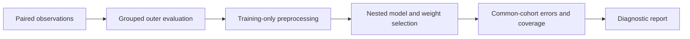
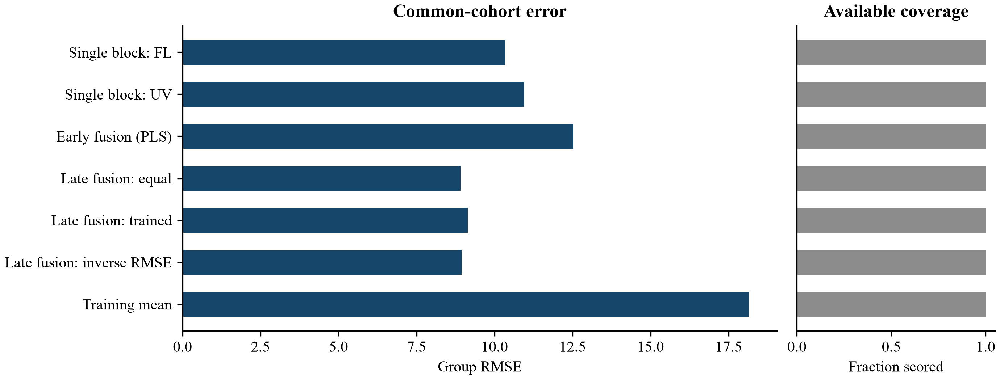

# SenseFusion

[](https://github.com/Shahin-asadi/sensefusion/actions/workflows/tests.yml)

[](https://github.com/Shahin-asadi/sensefusion/archive/refs/heads/main.zip)
[](GETTING_STARTED.md)
[](benchmarks/reference_run/olive_fusion/summary.pdf)
[](https://sensefusion.streamlit.app/)

**Browser app:** [Open SenseFusion](https://sensefusion.streamlit.app/), or run `START_WINDOWS.cmd` on Windows to process data locally.

**Does combining measurement blocks improve prediction and usable coverage?**

For researchers with paired spectral or sensor measurements, compare individual blocks, early fusion, equal late fusion, trained convex weights, inverse-RMSE weights and a training-mean reference. Preprocessing and tuning stay inside grouped training folds. Analysis runs on the computer or server hosting the app, without an AI service or API key. The local launcher keeps processing on your computer; an online deployment processes uploads on its server.





The figure uses the processed public measurements documented in [Data sources](DATA_SOURCES.json). It is an evaluated example, with its sample structure and limitations, rather than a claim of general laboratory performance. [Read the numerical results and diagnostic gallery](RESULTS.md).

## Start in three steps

1. Install Python **3.12 or 3.14** on Windows and extract the complete project folder.
2. On Windows, double-click **START_WINDOWS.cmd**. The first launch installs runtime dependencies into a local `.venv`; later launches can use the bundled examples offline.
3. Select a **Bundled example**, click **3. Run analysis**, then use **Results page** to read the overview and scientific sections. Download a detailed HTML/PDF report or the organized key-results ZIP.

The [worked walkthrough](GETTING_STARTED.md) explains input preparation, missing values, supported calculations and troubleshooting. [Validation](VALIDATION.md) records the actual environments and remaining browser/CI limits. Version **0.5.2** has local verification and a recorded [successful CI run](https://github.com/Shahin-asadi/sensefusion/actions/runs/34271635224). See [CI evidence](CI_STATUS.md) for the recorded commit and scope.

CSV, XLSX and pasted tables share one parser; row keys are optional. [Artificial starters](src/sensefusion/starter_files/) explain the roles. Use [Input guide](INPUT_GUIDE.md) and [Methods](METHODS.md) for missing data and operation-specific support.

## What you receive

- A concise overview followed by scientific sections with diagnostic plots and full tables from the same fitted result.
- Detailed offline HTML and paginated PDF reports, plus an organized key-results ZIP with reports, tables, figures and cohort records.
- Individual 300 dpi PNG, vector PDF and editable SVG figures; a figure catalogue explains every view.
- Complete CSV tables and a formatted `results.xlsx` workbook with separate sheets.
- A navigable, printable `report.html`, resolved `config.json`, environment/run record, source-code fingerprint and applicable dataset attribution.

Unknown reference measurements are never fabricated. Incomplete inputs can yield partial evidence or an input audit; a successful computation is not a validation certificate. Figures and diagnostic flags do not silently remove observations or change model fitting.

## Command line

```text
python -m venv .venv
```

Activate that environment, then install the runtime only:

```text
python -m pip install -c constraints.txt -e .
sensefusion demo --output runs/first_example
sensefusion app
```

For your own table, export the configuration from the interface and run:

```text
sensefusion analyse --input data.csv --config config.json --output runs/my_analysis
```

Choose a new or empty output directory so previous work is preserved. See [Configuration](CONFIGURATION.md), [Methods](METHODS.md), [Diagnostic guide](DIAGNOSTICS.md), [Data dictionary](DATA_DICTIONARY.md), [Reproducibility](REPRODUCIBILITY.md), and [References](REFERENCES.md).

Maintainer: [Shahin-asadi](https://github.com/Shahin-asadi). Code: MIT. Example measurements retain their original CC BY 4.0 attribution. [Development contributions](DECLARATION.md) · [Third-party notices](THIRD_PARTY_NOTICES.md) · [Contributing](CONTRIBUTING.md).
